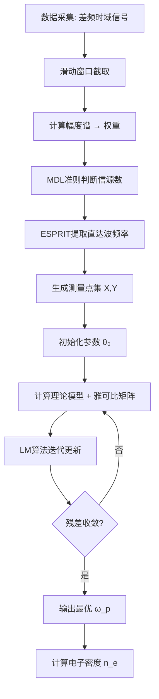

# 基于 LFMCW 滑动窗口特征提取与反向拟合的色散等离子体高精度诊断方法

## 项目概述

本项目针对临近空间高超声速飞行器等离子体鞘套诊断中的**强色散效应**与**多径干扰**问题,提出了一种基于线性调频连续波(LFMCW)的新型电子密度诊断方法。通过滑动窗口特征提取、MDL准则多径抑制、ESPRIT超分辨频率估计,以及加权Levenberg-Marquardt非线性反演,实现了对等离子体电子密度的高精度测量。

### 核心创新

- ✅ **色散效应建模**: 建立了LFMCW在色散介质中的非线性差频信号模型
- ✅ **特征点集提取**: 滑动窗口 + ESPRIT算法提取"频率-时延"特征曲线
- ✅ **多径抑制**: 基于MDL准则自动判别信源数,剔除反射波干扰
- ✅ **加权反演**: 构建包含系统误差的理论模型,利用LM算法高精度拟合
- ✅ **参数降维**: 理论证明碰撞频率对群时延的影响为二阶小量,可固定处理

---

## 理论基础

### 1. 等离子体色散特性 (Drude Model)

假设等离子体为非磁化均匀介质,其群速度 $v_g$ 随角频率 $\omega$ 变化:

$$
v_g(\omega) = c \sqrt{1 - \left(\frac{\omega_p}{\omega}\right)^2}
$$

其中 $\omega_p = \sqrt{\frac{n_e e^2}{\varepsilon_0 m_e}}$ 为等离子体特征角频率,直接对应待测电子密度 $n_e$。

**复介电常数**:

$$
\tilde{\varepsilon}_r(\omega) = 1 - \frac{\omega_p^2}{\omega(\omega + j\nu_e)} = \left(1 - \frac{\omega_p^2}{\omega^2 + \nu_e^2}\right) + j\left(\frac{\nu_e}{\omega} \frac{\omega_p^2}{\omega^2 + \nu_e^2}\right)
$$

### 2. 群时延的精确计算

电磁波在等离子体中的传播相位:

$$
\Phi(\omega) = \text{Re}\{\tilde{k}(\omega)\} \cdot d = \frac{\omega d}{c} \text{Re}\left\{\sqrt{\tilde{\varepsilon}_r(\omega)}\right\}
$$

**群时延定义** (相位对频率的导数):

$$
\tau_g(\omega) = \frac{d\Phi(\omega)}{d\omega}
$$

**相对群时延** (等离子体引起的附加时延):

$$
\Delta\tau(\omega) = \tau_g(\omega) - \frac{d}{c}
$$

> **代码实现**: 见 [`LM.m`](file:///e:/lunex/LoxieL/LM.m) 中的 `calculate_theoretical_delay` 函数,通过数值微分 `diff(phi)./diff(omega)` 实现。

### 3. LFMCW 色散效应与非线性差频

#### 3.1 时变群时延展开

LFMCW信号瞬时频率: $\omega(t) = \omega_0 + 2\pi K t$ (调频斜率 $K = B/T_m$)

在色散介质中,群时延在中心频率处泰勒展开至二阶:

$$
\tau(t) \approx \tau_0 + (2\pi K \tau_1) t + \frac{1}{2} (2\pi K)^2 \tau_2 t^2
$$

- $\tau_0$: 基础群时延
- $\tau_1$: 一阶色散系数 (Group Delay Dispersion, GDD) → 导致频率偏移
- $\tau_2$: 二阶色散系数 → 导致频谱展宽

#### 3.2 差频信号的瞬时频率

混频后差频信号的瞬时频率:

$$
f_{beat}(t) \approx \underbrace{K \tau_0}_{\text{理想项}} + \underbrace{f_0 K \tau_1}_{\text{系统性频移}} + \underbrace{(2 K^2 \tau_1 + f_0 K^2 \tau_2) \cdot t}_{\text{线性调频项(散焦)}}
$$

**物理意义**:
- **常数项**包含 $f_0 K \tau_1$,由于载波 $f_0$ (如34GHz) 远大于带宽,即使 $\tau_1$ 很小也会产生巨大偏移
- **线性项**表明差频频率随时间变化,导致FFT频谱展宽

**结论**: 直接对全段信号FFT会得到严重展宽且中心偏移的频谱,**必须采用时频切片分析**。

#### 3.3 色散效应工程阈值判据

定义**非线性度** $\eta$:

$$
\eta = \frac{\Delta \tau_{linear}}{\tau_0} = \frac{|\frac{d\tau}{df}| \cdot B}{\tau_0}
$$

**工程判定准则**:

$$
B \cdot \eta \cdot \tau_0 \leq 1
$$

- 若不等式成立,色散引起的频率误差小于FFT分辨率,可忽略
- 若不等式不成立,**必须**使用本文提出的高级算法

对于等离子体:

$$
\eta = \frac{B}{f_0} \cdot \frac{(f_c/f_0)^2}{1 - (f_c/f_0)^2}
$$

---

## 信号处理架构

### 1. 滑动窗口与瞬时探测频率

将差频信号分割为 $N$ 个重叠的时间窗口。第 $i$ 个窗口中心时刻 $t_i$ 对应的**探测频率**(系统已知量):

$$
X_i = f_{probe}(t_i) = f_{start} + K \cdot t_i
$$

### 2. 基于 MDL 准则的多径抑制

在微波暗室或金属腔体实验中,存在直达波与反射波的多径效应。采用**最小描述长度(MDL)**准则确定信源数 $k$:

$$
\text{MDL}(k) = -\ln\left(\frac{\prod_{j=k+1}^{M} \lambda_j^{\frac{1}{M-k}}}{\frac{1}{M-k} \sum_{j=k+1}^{M} \lambda_j}\right)^{(M-k)L} + \frac{1}{2} k (2M-k) \ln L
$$

- $M$: 窗口长度
- $L$: 快拍数
- $\lambda_j$: 协方差矩阵特征值(降序排列)

**策略**: 寻找使 $\text{MDL}(k)$ 最小的 $k$ 值作为真实信号源数量。

### 3. ESPRIT 超分辨频率估计

利用旋转不变子空间算法(ESPRIT)在每个窗口内进行频率估计,得到 $k$ 个频率分量。

**物理判据**: 反射路径必然长于直达路径,取 $k$ 个结果中**频率最小且能量显著**的分量作为直达波差频 $f_{beat,i}$。

**测量时延计算**:

$$
Y_i = \tau_{meas}(t_i) = \frac{f_{beat,i}}{K}
$$

**构建特征数据集**: $\mathcal{D} = \{(X_i, Y_i)\}_{i=1}^N$

---

## 参数反演算法

### 1. 包含误差项的理论模型

构建理论观测函数 $G(f, \mathbf{\theta})$,其中待求参数向量 $\mathbf{\theta} = [\omega_p, d]$。

该模型**显式包含**测量原理引入的一阶色散误差:

$$
Y_{theory}(f; \omega_p, d) = \tau_{group}(f) + \underbrace{\frac{f}{K} \cdot \frac{\partial \tau_{group}(f)}{\partial f}}_{\text{一阶色散修正项}}
$$

其中 Drude 模型群时延:

$$
\tau_{group}(f) = \frac{d}{c} \frac{1}{\sqrt{1 - (\omega_p/2\pi f)^2}}
$$

### 2. 加权代价函数 (Weighted Cost Function)

考虑到探测频率 $f$ 接近截止频率 $f_p$ 时,信号衰减剧烈,信噪比(SNR)显著下降。引入加权矩阵防止低信噪比数据主导拟合:

$$
J(\mathbf{\theta}) = \sum_{i=1}^{N} w_i \cdot \left(Y_i - Y_{theory}(X_i; \mathbf{\theta})\right)^2
$$

**权重因子设计**:

$$
w_i = \left(\frac{A_i}{\max(\mathbf{A})}\right)^2
$$

其中 $A_i$ 为滑动窗口内的信号幅度(RMS值)。

### 3. Levenberg-Marquardt (LM) 优化算法

鉴于 Drude 模型在截止频率附近高度非线性,采用 LM 算法进行参数迭代求解。

定义残差向量 $\mathbf{r}(\mathbf{\theta})$,其第 $i$ 元素:

$$
r_i = \sqrt{w_i}(Y_i - Y_{theory}(X_i, \mathbf{\theta}))
$$

计算雅可比矩阵(Jacobian Matrix) $\mathbf{J}$:

$$
J_{ij} = \frac{\partial r_i}{\partial \theta_j}
$$

**LM 迭代公式**:

$$
\mathbf{\theta}_{k+1} = \mathbf{\theta}_{k} - \left(\mathbf{J}^T \mathbf{J} + \mu \mathbf{I}\right)^{-1} \mathbf{J}^T \mathbf{r}
$$

**阻尼因子 $\mu$ 的作用**:
- $\mu$ 较大时: 近似梯度下降法,保证初始阶段稳定性
- $\mu$ 较小时: 近似高斯-牛顿法,利用二阶曲率信息快速收敛

---

## 碰撞频率参数降维策略

### 1. 二阶小量证明

在高频弱碰撞条件下 $(\nu_e/\omega)^2 \ll 1$,对复介电常数实部泰勒展开:

$$
\varepsilon'(\omega) \approx \underbrace{\left(1 - \frac{\omega_p^2}{\omega^2}\right)}_{\text{主导项(无碰撞)}} + \underbrace{\frac{\omega_p^2}{\omega^2}\left(\frac{\nu_e}{\omega}\right)^2}_{\text{碰撞修正项}}
$$

**结论**:
- 电子密度 ($n_e \propto \omega_p^2$) 出现在主导项,对群时延起**一阶决定作用**
- 碰撞频率 ($\nu_e$) 出现在修正项,且以 $(\nu_e/\omega)^2$ 形式存在,为**二阶小量**

### 2. 数值灵敏度验证

仿真条件: $f \in [34, 38]$ GHz, $d=15$ cm, $n_e=10^{19}$ m$^{-3}$

当 $\nu_e$ 从 0.1 GHz 增加到 10.0 GHz (变化100倍):
- **群时延变化**: $\delta\tau_{max} \approx 0.005$ ns (远低于测量不确定度 >0.1 ns)
- **幅度衰减变化**: >20 dB (显著可观测)

### 3. 反演问题的病态性分析

构建目标函数 $J(n_e, \nu_e)$,其雅可比矩阵:

$$
\mathbf{J}_k = \left[\frac{\partial \tau(f_k)}{\partial n_e}, \quad \frac{\partial \tau(f_k)}{\partial \nu_e}\right]
$$

由于 $\frac{\partial \tau}{\partial \nu_e} \approx 0$ (二阶小量),导致海森矩阵近似 $\mathbf{H} \approx \mathbf{J}^T \mathbf{J}$ 的条件数趋于无穷:

$$
\text{cond}(\mathbf{H}) = \frac{\lambda_{max}}{\lambda_{min}} \to \infty
$$

**后果**: 矩阵奇异,无法求逆,算法不收敛或 $\nu_e$ 随机漂移。

### 4. 参数降维策略

**结论**: 在仅依赖群时延数据的反演任务中,$\nu_e$ 表现为**不可观测的二阶微扰量**。

**策略**: 将 $\nu_e$ 固定为经验常数(如 1.5 GHz),仅对电子密度 $n_e$ 进行单参数寻优。

**误差分析**: 由 $\nu_e$ 的不确定性(如 $\pm50\%$)引入的时延模型误差 <0.005 ns,相对于电子密度引起的纳秒级时延变化,该误差**完全可以忽略**。

---

## 代码架构

### 文件说明

| 文件 | 功能 | 算法 | 复杂度 |
|------|------|------|--------|
| [`initial.m`](file:///e:/lunex/LoxieL/initial.m) | 基础仿真 + 传统诊断 | FFT + 三角形校正 | ⭐⭐ |
| [`LM.m`](file:///e:/lunex/LoxieL/LM.m) | 完整仿真 + 高级反演 | ESPRIT + MDL + 加权LM | ⭐⭐⭐⭐⭐ |
| [`nu.m`](file:///e:/lunex/LoxieL/nu.m) | 碰撞频率灵敏度分析 | 参数扫描 + 对比 | ⭐⭐ |
| [`untitled.m`](file:///e:/lunex/LoxieL/untitled.m) | 反演多解性论证 | 参数空间曲线交点 | ⭐⭐⭐ |

### 算法流程总结



---

## 使用指南

### 快速开始

#### 1. 运行基础仿真 (传统方法)

```matlab
>> initial
```

**输出**:
- Figure 1-4: 发射/接收信号时域频域对比
- Figure 5-8: 差频信号时频分析
- Figure 10: 高精度频谱校正与诊断结果
- 命令行: 电子密度反演结果与误差

#### 2. 运行高级反演 (本文方法)

```matlab
>> LM
```

**输出**:
- Figure 9: ESPRIT测量点 vs Drude理论曲线
- Figure 11: 加权拟合结果与权重分布
- 命令行: LM迭代过程与最终误差

#### 3. 物理特性分析

```matlab
>> nu          % 碰撞频率灵敏度对比
>> untitled    % 参数空间多解性论证
```

---

### 参数调整指南

#### 修改等离子体参数

在 [`LM.m`](file:///e:/lunex/LoxieL/LM.m) 第 1 节:

```matlab
% 传播介质参数
tau_air = 4e-9;       % 空气总时延 (s)
tau_fs = 1.75e-9;     % 单侧自由空间时延 (s)
d = 150e-3;           % 等离子体厚度 (m)
f_c = 34e9;           % 截止频率 (Hz) → 决定 n_e
nu = 1.5e9;           % 碰撞频率 (Hz, 可固定)
```

> **注意**: 修改 `f_c` 后,电子密度自动重新计算:
> ```matlab
> n_e = (omega_p^2 * epsilon_0 * m_e) / e^2;
> ```

#### 修改雷达参数

```matlab
f_start = 34.2e9;     % 起始频率 (Hz)
f_end = 37.4e9;       % 终止频率 (Hz)
T_m = 50e-6;          % 调制周期 (s)
f_s = 80e9;           % 采样率 (Hz, 需 ≥ 2*f_end)
```

#### 调整反演算法参数

在 [`LM.m`](file:///e:/lunex/LoxieL/LM.m) 第 7.2 节:

```matlab
win_time = 12e-6;              % ESPRIT窗口长度 (越长频率分辨率越高)
step_len = round(win_len/10);  % 滑动步长 (越小曲线越平滑,计算量大)
L_sub = round(win_len/2);      % 子空间维度
```

在第 9.2 节:

```matlab
f_c_guess = 0.85 * min(X_fit);  % 初始截止频率猜测 (建议 0.8-0.9)
```

---

## 结果解读

### 诊断精度对比

| 方法 | 典型误差 | 适用场景 | 色散适应性 |
|------|----------|----------|-----------|
| 传统差频法 (`initial.m`) | 5-15% | 快速估算,弱色散 | 低 |
| 加权LM反演 (`LM.m`) | < 5% | 高精度测量,强色散 | 高 |

### 关键图表说明

#### Figure 9 (LM.m): 群时延色散曲线拟合

- **蓝色散点**: ESPRIT提取的测量值 (特征点集)
- **红色曲线**: 全复数Drude模型理论值 (含碰撞频率)
- **横轴**: 探测频率 (GHz)
- **纵轴**: 相对群时延 $\Delta\tau$ (ns)

**判断标准**: 散点应紧密分布在理论曲线附近,偏离表示:
- 模型失配 (如忽略了非均匀性)
- 噪声过大
- 多径干扰未完全抑制

#### Figure 11 (LM.m): 加权拟合质量评估

- **上图**: 加权拟合结果 (颜色=权重,高权重点对反演贡献大)
- **下图**: 权重分布 (接近截止频率处权重降低,避免低SNR数据主导)

---

## 物理洞察

### 1. 碰撞频率的影响 ([`nu.m`](file:///e:/lunex/LoxieL/nu.m))

**数值实验**: $\nu_e$ 从 0.1 GHz → 10 GHz (变化100倍)

| 物理量 | 变化量 | 可观测性 |
|--------|--------|----------|
| 群时延 $\Delta\tau$ | < 0.01 ns | 极弱 (淹没在噪声中) |
| 幅度衰减 | > 20 dB | 强 (显著可测) |

**结论**: 
- 群时延对 $\nu_e$ 具有天然的"钝感"
- 若要反演 $\nu_e$,需引入**幅度测量**数据
- 仅用时延数据时,可将 $\nu_e$ 固定,不影响 $n_e$ 反演精度

### 2. 反演多解性 ([`untitled.m`](file:///e:/lunex/LoxieL/untitled.m))

在参数空间 $(n_e, d)$ 中,不同参数组合可能产生相似的 $\tau(f)$ 曲线,导致反演不唯一。

**缓解策略**:
- 增加探测频段宽度 $B$
- 引入独立约束 (如厚度 $d$ 已知)
- 使用多频段联合反演
- 利用物理先验 (如 $n_e$ 的合理范围)

---

## 技术要点

### 数值稳定性修正

#### 1. FFT 频率轴处理 (负频率)

```matlab
% 构建包含负频率的完整频率轴
f = (0:N-1)*(f_s/N);
idx_neg = f >= f_s/2;
f(idx_neg) = f(idx_neg) - f_s;
omega = 2*pi*f;
```

#### 2. 防止除零

```matlab
omega_safe = omega;
omega_safe(omega_safe == 0) = 1e-10;
epsilon_r_complex(omega == 0) = 1;
```

#### 3. 强制物理衰减

```matlab
% 错误写法 (可能导致增益爆炸)
H_plasma = exp(-1i * k_complex * d);

% 正确写法 (确保衰减)
k_real = real(k_complex);
k_imag = imag(k_complex);
H_plasma = exp(-1i*k_real*d - abs(k_imag)*d);
```

### 优化技巧

#### 1. 参数归一化

将 $10^{19}$ 量级的 $n_e$ 归一化到 $O(1)$,避免梯度消失:

```matlab
scale_factor = 1e19;
param_scaled = n_e / scale_factor;
```

#### 2. 强制探索步长

```matlab
options = optimoptions('lsqnonlin', ...
    'DiffMinChange', 0.01, ...  % 最小微分步长 1%
    ...);
```

防止优化器在初始点因梯度过小而停止。

#### 3. 物理约束 (软边界)

```matlab
% 检查截止频率是否进入探测区
fc_val = sqrt(ne_val * e^2 / (eps0 * me)) / (2*pi);
if fc_val >= (min(f_data) - 0.05e9)
    F_vec = ones(size(f_data)) * 1e5;  % 惩罚项
    return;
end
```

---

## 常见问题

### Q1: 为什么要用滑动窗口而不是全段FFT?

**A**: 色散导致差频信号自身变成Chirp信号,全段FFT会严重展宽。滑动窗口将非平稳信号局部化为准平稳,每个窗口内可视为单频,从而提取"频率-时延"映射关系。

### Q2: MDL准则的物理意义是什么?

**A**: MDL平衡了模型复杂度与数据拟合度。信源数过少会欠拟合(漏掉真实信号),过多会过拟合(将噪声当信号)。MDL自动选择最优折衷点。

### Q3: 为什么要加权拟合?

**A**: 接近截止频率时信号衰减剧烈,SNR下降,数据不可靠。加权使高SNR区域(远离截止频率)对拟合贡献更大,提高鲁棒性。

### Q4: LM算法报错 "截止频率进入探测区"?

**A**: 初始猜测的 $n_e$ 过大。解决方法:
```matlab
f_c_guess = 0.80 * min(X_fit);  % 降低系数 (从 0.85 → 0.80)
```

### Q5: ESPRIT提取的点太少?

**A**: 增加滑动窗口重叠率或降低抽取因子:
```matlab
decimation_factor = 100;  % 从 200 降低
step_len = round(win_len / 20);  % 从 /10 改为 /20
```

---

## 依赖项

- MATLAB R2018b 或更高版本
- Signal Processing Toolbox (`butter`, `filtfilt`, `hann`)
- Optimization Toolbox (`lsqnonlin`)

---

## 引用

如果本项目对您的研究有帮助,请引用:

```bibtex
@software{lfmcw_plasma_diagnostics,
  title = {LFMCW-Based Plasma Diagnostics with Dispersion Compensation},
  author = {LoxieL},
  year = {2025},
  url = {https://github.com/yourusername/LoxieL}
}
```

---

## 许可证

MIT License

---

## 联系方式

如有问题或建议,请提交 Issue 或 Pull Request。

---

**最后更新**: 2025-12-23
